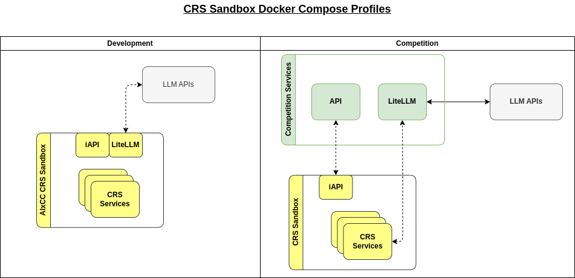

# CRS Sandbox

This repository, the `CRS Sandbox` includes a `docker-compose.yaml` file. 
This file is the only resource competitors will have for infrastructure automation at competition time.
Environment variables and secrets will be injected into the `docker-compose.yaml` from each competitors private copy of the `CRS Sandbox`.

Competitor SSO accounts to Github will be limited to a basic set of actions for making modifications and merging PRs within the Github repo. 

At competition time a specific subset of secrets and environment variables will be wiped from all of the private repos and competitors will no longer have access to change these at competition time. This is so the AIxCC infrastructure team can replace the LiteLLM instance and credentials used to access the LiteLLM API in order to track individual competitor LLM usage at competition time. 

# Environment Variables & Github Secrets
Each competitors CRS will come pre-packaged with a list of Github secrets and environment variables. Teams may change the values of these secrets, however they must not change the name of the pre-existing secrets or variables and must ensure their application code uses the core variables related to the iAPI and LiteLLM connections.  

This is so the AIxCC infrastructure team can override the per-competitor secrets and variables at competition time, yet competitors can use these secrets for connecting to their cloud vendor and/or LLM APIs as needed.

*TBD* - These variables and the LiteLLM configuration file are not yet complete. This will be released in a CRS sandbox update. We will continue iterating on the CRS sandbox as we grow closer to the competition in order to support newer versions of components in order to stay compatible with the latest LLM models and tech as this changes almost daily. 

Please see the competition rules and technical release as the cut off dates for changes will be descibed there. 

# Local Development

## Github Personal Access Token (PAT)
In order to work with the CRS Sandbox you must setup your Github personal access token or PAT following these steps. 
1. Configure a personal access token (PAT) with `read:packages` permission by following this [guide](https://docs.github.com/en/packages/working-with-a-github-packages-registry/working-with-the-container-registry#authenticating-with-a-personal-access-token-classic)
2. Authorize the generated PAT for the `aixcc-sc` organization by this [guide](https://docs.github.com/en/enterprise-cloud@latest/authentication/authenticating-with-saml-single-sign-on/authorizing-a-personal-access-token-for-use-with-saml-single-sign-on)
3. Run `echo "example-token-1234" | docker login ghcr.io -u USERNAME --password-stdin` replacing example-token-1234 with your generated PAT
4. Confirm that you see `> Login Succeeded` in your output from step #3. 

## Github SSH Key
1. Generate an SSH key by following this [guide](https://docs.github.com/en/enterprise-cloud@latest/authentication/connecting-to-github-with-ssh/generating-a-new-ssh-key-and-adding-it-to-the-ssh-agent)
2. Upload the generated SSH key to your AIxCC Github account by following this [guide](https://docs.github.com/en/enterprise-cloud@latest/authentication/connecting-to-github-with-ssh/adding-a-new-ssh-key-to-your-github-account)
3. Follow this [guide](https://docs.github.com/en/enterprise-cloud@latest/authentication/authenticating-with-saml-single-sign-on/authorizing-an-ssh-key-for-use-with-saml-single-sign-on) to authorize the SSH key for the `aixcc-sc` organization

## Using Make
A Makefile has been provided with a number of a commands to make it easy to clone the exemplar repos, stand up the environment, and a variety of other actions. 

`make cps` - clones the exemplar challenges into `./cp_root` folder
`make up` - brings up the development CRS Sandbox, you can visit http://127.0.0.1:8080/docs to see the iAPI OpenAPI spec.

The CRS Sandbox currently uses Grafana/K6 as a placeholder for the CRS solution itself and is used to validate that the sandbox can reach the proper HTTP endpoints within the iAPI and LiteLLM containers.

`make down` - tears down the development CRS Sandbox

See [Makefile](./Makefile) for more commands

## Kubernetes
The Makefile includes endpoints for `make k8s` and `make k8s/helm` which will generate resources in a `./.k8s/` folder which can be applied to your own Kubernetes clusters for testing. This uses a component called [Kompose](https://kompose.io/conversion/) for translating the Docker Compose file into resources.

## Dependencies
- docker >= 24.0.5
- docker-compose >= 2.24.7
- GNU make >= 4.3
- kompose >= 1.32.0 (only for Kubernetes resources)

We've included a Makefile with helpful targets to make working with the CRS Sandbox easier. However, you can copy any commands and run them on your own. Please note the use of `--profile` with all `docker-compose` commands. This is so we can easily swap `--profile development` with `--profile competition` at competition time, but competitors can use the `--profile development` to run the local copy of emulated resources. 

## Architecture Diagram

This diagram depicts the CRS Sandbox during the `development` phase with `--profile development` and during the `competition` phase with `--profile competition`.
As you can see the iAPI remains as part of the CRS Sanbox but can communicate with the upstream API. However, the LiteLLM component moves to a centralized component that does not run within the CRS Sandbox at competition.

