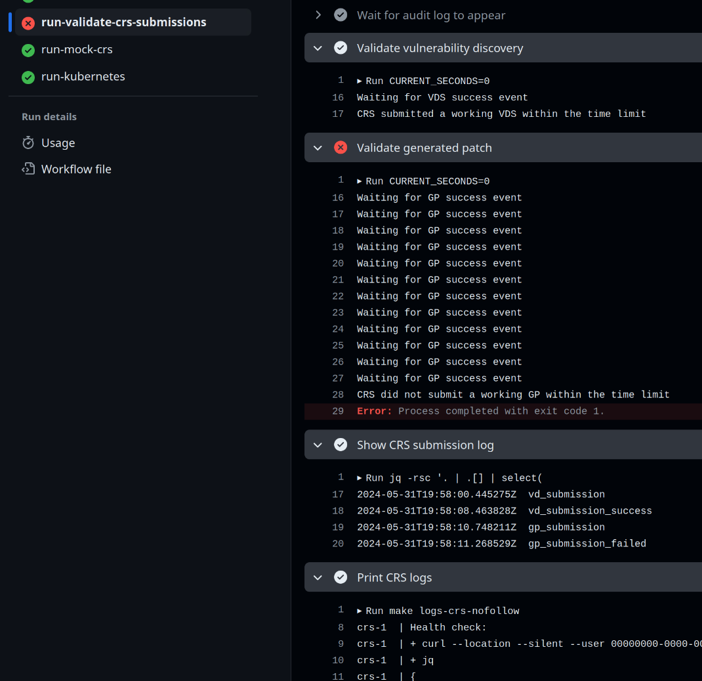
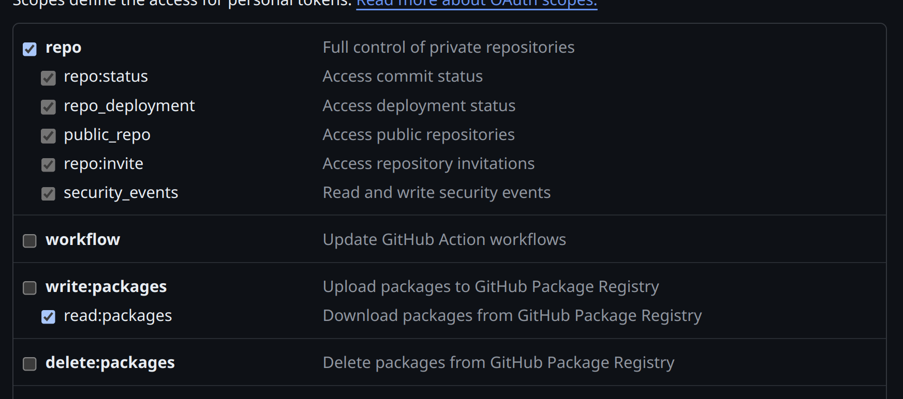
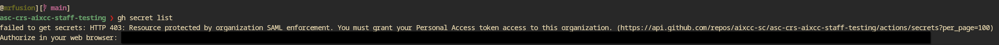
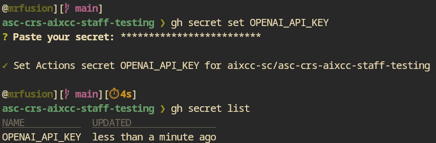

This repo was used as part of the semifinals competition for DARPA + ARPA-H's [AI Cyber Challenge](https://aicyberchallenge.com/).

The CRS Sandbox was the basis on which competitors built their Cyber Reasoning Systems (CRS).  They copied and customized this repository to add code and Docker containers.  The CRS Sandbox provided them a framework to test their CRSs locally via docker-compose while still retaining the ability to deploy to Kubernetes (using [Kompose](https://kompose.io/)), which was the environment that CRSs ran in for semifinals.  The Makefile in this repository was the main interface for competitors.
 
During semifinals, this base repository was updated regularly and pull requests were generated to provide competitors with bugfixes.

Everything in this repo assumes a base Ubuntu 22.04 installation as its development environment.

The rest of this README is unaltered from its state at the end of semifinals, with the exception of an additional section linking some new documentation on using this repo to run a CRS now that semifinals have concluded.

# CRS Sandbox

This repository, the `CRS Sandbox` includes a [./compose.yaml](./compose.yaml) file.
This file is the only resource competitors will have for infrastructure automation at competition time.
Environment variables and secrets will be injected into [./compose.yaml](./compose.yaml)
from each competitors private copy of the `CRS Sandbox`.

Competitor SSO accounts to GitHub will be limited to a basic set of actions for making modifications and merging PRs within the GitHub repository.

## CRS Testing

To test a CRS in a semifinals-like environment, see [this document.](./LOCAL_CRS_TESTING.md)

## Final Submission
The submission window closes July 15, 2024 at 11:59pm UTC [FAQ page 5](https://aicyberchallenge.com/faqs/)
At that time, your CRS repository will become read-only and vCluster access will be removed. The latest tagged release in your repository for images and the crs-manifest will be used for competition.

### Checklist
- Set your [GHCR_PULL_TOKEN](#github-personal-access-token) **variable** with a token set to expire **no earlier** than September 1st 2024.
- Merge at least one pull request into `main` with your CRS code.
- Merge at least v2.6.6 (b873c19) of the CRS Sandbox into your CRS repository. (Teams are encouraged to [merge newer releases](#getting-upstream-crs-sandbox-updates-in-your-repository-template-syncing) as they may fix bugs while remaining interface compatible.)
(You MUST merge the PR titled "upstream merge template repository" if it exists in your competitor CRS repository. If you have not merged the one with the contents `Merge git@github.com:aixcc-sc/crs-sandbox b873c19` then you may not have the 2.6.6 version of crs-sandbox).
- Cut a [release](#release-process) with the a tag >= `v1.0.0` from `main`.
- Verify that the container images and `crs-manifest` generated during the release have the tags expected by your crs.
- You did it! Thank you for getting this far, see you at DEFCON 🎉

*If you change this token, you must submit an issue to crs-sandbox to notify us that your token has changed so that we can set it correctly in your vCluster environment.*


## Reporting Bugs & Issues

Competitors should use GitHub issues to report bugs on the respective repositories.

Competitors are also welcome to comment in tickets assisting others.

We encourage all competitors to read through issues (open & closed) within the following repos.

- [CRS Sandbox](https://github.com/aixcc-sc/crs-sandbox/issues)
- [CP Sandbox](https://github.com/aixcc-sc/cp-sandbox/issues)
- [Mock CP](https://github.com/aixcc-sc/mock-cp/issues)
- [Competition API (cAPI)](https://github.com/aixcc-sc/cAPI/issues)

## Evaluation Window

### Phase 1 - GitHub Actions Passing

Date: 2024-05-30

On the above date, teams will be provided access to their private CRS repositories.

This repository will be generated from the CRS Sandbox reference repository which will be treated as the template repository.

Merging into main will require the workflows specified in `.github/workflows/evaluator.yml` and `.github/workflows/package.yml` to pass.

Competitors MUST release at least one version of their CRS during Phase 1 to validate their package workflow correctly executes.

Failure to do so will prevent a team's CRS from moving forward to Phase 2.

During Phase 1, teams must use their own secret keys and tokens to access collaborator resources
(LLM APIs) and authenticate against GitHub.

#### Interpreting Results in GitHub Actions

The job that evaluates the CRS's performance is part of the [CRS Evaluator](https://github.com/aixcc-public/crs-sandbox/actions/workflows/evaluator.yml) and is called `run-validate-crs-submissions`.

It runs the CRS as defined in the [./compose.yaml](./compose.yaml) and evaluates its submitted vulnerability discoveries and generated patches.
Check the output of the validation steps, CRS submission log step, and CRS logs step for introspection into what happened.



https://github.com/user-attachments/assets/f3dd9723-29f6-4f0f-9714-3b624cebb2e8

### Phase 2 - Automated Execution of your CRS

Date: 2024-06-21 - 2024-07-15 11:59pm UTC

On the above date, the AIxCC Game Architecture team will automatically execute competitors CRSs against a subset of published challenge problems.
By modifying [cp_config/cp_config.yaml](./cp_config/cp_config.yaml), competitors can change the CPs
presented to their CRS during phase 2.

The CRS MUST be released via [GitHub Release](https://docs.github.com/en/repositories/releasing-projects-on-github/managing-releases-in-a-repository)
and you MUST merge at least one pull request with a passing Evaluator workflow.

Competitors must release new versions of their CRS with an updated tag from `main` after the start of Phase 2 in order to trigger provisioning of their cluster.

Teams MUST merge the automated upstream pull requests in their repos OR rebase for CRS Sandbox version >= `v2.6.6`.

With each new release of a competitors CRS it will be automatically deployed.

Only the latest semantic version of a competitors CRS that is properly tagged from `main` will be tested in Phase 2.

During Phase 2, secret keys and tokens for collaborator resources (LLM APIs) and GitHub access will
be set by the AIxCC infrastructure team.

Competitors will be able to evaluate their CRS in this environment each time they make a new release of their CRS.

The vCluster environment will use the same SSO from the [AIxCC Dashboard](https://dashboard.aicyberchallenge.com).

Competitors MUST modify their PAT to add `repo` and `read:packages` level access to their classic PAT.



Competitors MUST add their PAT with the GitHub CLI with the name `GHCR_PULL_TOKEN`.
They may do this by running `gh variable set GHCR_PULL_TOKEN` and adding the PAT from above.

The process for creating the PAT is outlined under [GitHub Personal Access Token](#github-personal-access-token).

Teams will be able to log into their vCluster at [https://vcluster-platform.aixcc.tech/login](https://vcluster-platform.aixcc.tech/login)

During competition, CRSs may only submit a single working vulnerability discovery on any single
commit, and must use that issued CPV UUID for any generated patches.  Any further VDSs will be
rejected as duplicates.  During phase 2, however, **duplicate submissions will not be rejected** in
order to facilitate rapid CRS testing.  We may turn rejection back on towards the end of phase 2.

https://github.com/user-attachments/assets/20bb23b7-7c7c-4af6-b404-bc028b6e61ef

### vCluster CRS Guide

All of your CRS code is deployed in the `crs` namespace. Deleting the `crs` namespace will cause your CRS deployment to be completely wiped. This requires [kubectl](https://kubernetes.io/docs/tasks/tools/#kubectl) and [flux](https://fluxcd.io/flux/installation/#install-the-flux-cli]). Get the connection details from the vCluster UI (Connect button in the top right corner).

Make sure that you see results when you run each of these commands before proceeding.

```bash
kubectl get pods -A
flux get kustomizations
```

If you want to clean up your CRS deployment, you can delete the `crs` namespace. This will remove all resources in the namespace, including the namespace itself and automatically get re-created within the sync window (currently 3 minutes). If you would like to stop your CRS and not have it be re-created, run the following commands:

```bash
flux suspend ks crs -n flux-system
flux suspend ks crs-injections -n flux-system
kubectl delete namespace crs
```

When you would like to start your CRS deployment again, run the following commands:

```bash
flux resume ks crs-injections -n flux-system
flux resume ks crs -n flux-system
```

CRS Deployments to vCluster have certain environment values overriden. You must use be sure to make any services you are using are configured properly in the `kompose_competition_overrides.yaml` file.

Please feel free to open an issue in the [CRS Sandbox] if you run into issues with your vCluster in particular.

## GitHub Personal Access Token

To work with the CRS Sandbox and vCluster you must set up your GitHub Personal Access Token (PAT) by following these steps.

1. Create a Personal Access Token (PAT) set to expire **no earlier** than September 1st 2024.*** with the scopes `read:packages` and `repo` set. You MUST ensure it is authorized for SSO by clicking `Configure SSO` and `Authorize` for aixcc-sc.
See the following references for more information: [Authenticating with a personal access token](https://docs.github.com/en/packages/working-with-a-github-packages-registry/working-with-the-container-registry#authenticating-with-a-personal-access-token-classic) and
 [Authorize for SSO](https://docs.github.com/en/enterprise-cloud@latest/authentication/authenticating-with-saml-single-sign-on/authorizing-a-personal-access-token-for-use-with-saml-single-sign-on).

2. Confirm the following commands work (*replacing ghp_\<CHANGE_ME\> with your generated PAT*)

    ```bash
    echo "ghp_<CHANGE_ME>" | docker login ghcr.io -u USERNAME --password-stdin
    docker manifest inspect ghcr.io/aixcc-sc/load-cp-images
    git ls-remote https://oauth2:ghp_<CHANGE_ME>@github.com/aixcc-sc/crs-injections.git
    ```

3. Competitors *MUST* set the value of their PAT as a variable using the [*GitHub CLI*](https://github.com/cli/cli#installation) with the name `GHCR_PULL_TOKEN`. They may do this by running this command and pasting their PAT variable from above:

    ```bash
    gh variable set GHCR_PULL_TOKEN
    ? Paste your variable
    ```

The Game Architecture team will use this variable to pull your repository images at competition time. *If you change this token, you must submit an issue to crs-sandbox to notify us that your token has changed so that we can set it correctly in your vCluster environment.*

## Code Owners

Please review the [.github/CODEOWNERS](.github/CODEOWNERS) file.

This file shows all the files that require pull request approval by the Game Architecture team.
The `main` branch protections will prevent making changes to these files.

The following paths have push protections in place.
They cannot be modified even within a private branch or pull request.

If you feel like one of these items needs modified, please make a [CRS Sandbox Issue](https://github.com/aixcc-sc/crs-sandbox/issues/new).

The Game Architecture team will review the request and respond accordingly.

```bash
.github/actions/trigger-downstream-sync.mjs
.github/workflows/evaluator.yml
.github/workflows/README.md
.github/workflows/template-sync.yml
.github/workflows/trigger-sync-on-release.yml
.tool-versions
charts/*
cp_root/*
crs_scratch/*
dind_cache/*
LICENSE
Makefile
README.md
sandbox/*
```

## Docker Images

Competitors MUST push all container images that are contained in [compose.yaml](./compose.yaml) to their CRS repository.

All container images MUST contain a tag.

Docker Compose services which contain a `build` section MUST be added to [package.yaml](./.github/workflows/package.yml).

If your solution is referencing a public container like PostgreSQL or MongoDB, you MUST push this image to your CRS repository.

You MUST push these images with a tag to your CRS OCI repository and reference this image using the `ghcr.io` link.

GitHub has the following [Container Registry](https://docs.github.com/en/packages/working-with-a-github-packages-registry/working-with-the-container-registry) instructions.

Failure to follow these steps will prevent your CRS images from being able to execute at the competition.

Competitors SHOULD use a tag similar to `:${RELEASE_TAG-v1.0.0}` for all images in their [./compose.yaml](./compose.yaml) that are built
and pushed automatically with [.github/workflows/package.yml](.github/workflows/package.yml).

This will make releases update automatically in the Kubernetes resources.

## CRS Constraints on Docker and Virtualization

In the competition environment, a CRS is expected to use Docker (via `run.sh`)
to exercise the CPs that are packaged and configured to be built, tested, and
patched using the provided Docker container.

One CP (the public Linux kernel CP) includes `virtme-ng` in its CP-specific
Docker container for the purposes of testing the built kernel.

The `virtme-ng` program will automatically use `/dev/kvm` for acceleration if it is present and the CRS is running as root [See Linux CP #10](https://github.com/aixcc-sc/challenge-001-linux-cp/issues/10#issuecomment-2186565915).

Competitors are permitted to add `privileged: true` to any container under [./compose.yaml](./compose.yaml).

The Game Architecture team has confirmed the CRS execution environment supports nested virtualization for KVM.

There is no need or support for competitors to map devices directly, they must add the `privileged: true` to containers which need it.

## LiteLLM Models Supported

| Provider  | Model                  | Pinned Version              | Requests per Minute (RPM) | Tokens per Minute (TPM)  |
| --------- | ---------------------- | --------------------------- | ------------------------- | ------------------------ |
| OpenAI    | gpt-3.5-turbo          | gpt-3.5-turbo-0125          | 800                       | 80,000                   |
| OpenAI    | gpt-4                  | gpt-4-0613                  | 200                       | 20,000                   |
| OpenAI    | gpt-4-turbo            | gpt-4-turbo-2024-04-09      | 400                       | 60,000                   |
| OpenAI    | gpt-4o                 | gpt-4o-2024-05-13           | 400                       | 300,000                  |
| OpenAI    | text-embedding-3-large | text-embedding-3-large      | 500                       | 200,000                  |
| OpenAI    | text-embedding-3-small | text-embedding-3-small      | 500                       | 200,000                  |
| Anthropic | claude-3-sonnet        | claude-3-sonnet-20240229    | 1,000                     | 80,000                   |
| Anthropic | claude-3.5-sonnet      | claude-3-5-sonnet-20240620  | 1,000                     | 80,000                   |
| Anthropic | claude-3-opus          | claude-3-opus-20240229      | 1,000                     | 40,000                   |
| Anthropic | claude-3-haiku         | claude-3-haiku-20240307     | 1,000                     | 100,000                  |
| Google    | gemini-pro             | gemini-1.0-pro-002          | 120                       | pending (as of 20240610) |
| Google    | gemini-1.5-pro         | gemini-1.5-pro-preview-0514 | 120                       | pending (as of 20240610) |
| Google    | textembedding-gecko*   | textembedding-gecko@003*    | pending (as of 20240610)  | pending (as of 20240610) |

Note: OpenAI Embedding models have not currently been released in more than a single version, thus pinned/name strings are identical.

Some OpenAI models will also be matched by an Azure-hosted version:
| Provider | Model                  | Pinned Version         | Requests per Minute (RPM) | Tokens per Minute (TPM) |
| -------- | ---------------------- | ---------------------- | ------------------------- | ----------------------- |
| Azure    | gpt-3.5-turbo          | gpt-3.5-turbo-0613     | 100                       | 80,000                  |
| Azure    | gpt-4o                 | gpt-4o-2024-05-13      | 100                       | 300,000                 |
| Azure    | text-embedding-3-large | text-embedding-3-large | 100                       | 120,000                 |
| Azure    | text-embedding-3-small | text-embedding-3-small | 100                       | 120,000                 |

Competitors will be able to freely request the model they like by the Model name in chart above, plus a prefix "oai-" or "azure-".
Ex. "oai-gpt-4o".
This was done because of performance differences between the models as hosted on OAI vs Azure infrastructure.
The models themselves are guaranteed to be identical but no such promises can be made as regards supporting provider infrastrcture.

Note: OAI Embedding models have not currently been released in more than a single version.

These models are all utilized by hitting the LiteLLM /chat/completions endpoint, specifying model and message using the OpenAI JSON request format.
This is the tentative complete list of models.

The Requests per Minute (RPM) and Tokens per Minute (TPM) columns in the table above are
rate limits that are enforced per CRS for the ASC. The LiteLLM proxy will be responsible for
implementing these limits. The RPM and TPM limits are enforced per model, not in aggregate across
models or providers.

Note: the "\*" next to model "textembedding-gecko" indicates this model target is still in flux.
The AIxCC infrastructure team is still waiting on LiteLLM to finalize support for the model
"text-embedding-004". If this newer model is not integrated in time to support its use during the
ASC, then the fallback will likely be "textembedding-gecko@003".

## Getting upstream CRS-Sandbox updates in your repository (template syncing)

The CRS Sandbox repository will be updated with new features and bugfixes over time. It is important to keep your repository up to date with these changes. On each release of crs-sandbox, a Pull Request is created in each competitor repository named "upstream merge template repository". You should merge this into your `main` branch as soon as possible.
It is critical to *NOT* revert this PR once you have merged it in. If it causes issues, open a new issue in the crs-sandbox repository. It is currently set to always take competitor code in case of conflict.

You can also manually trigger an update from crs-sandbox `main` by going to Actions -> Create PR to merge from upstream Template and clicking `Run workflow`.

## Local Development

We recommend using Ubuntu 22.04 LTS for CRS Sandbox development and will be unable to investigate issues with other base operating systems.

### GitHub SSH Key

1. Generate an SSH key by following this [guide](https://docs.github.com/en/enterprise-cloud@latest/authentication/connecting-to-github-with-ssh/generating-a-new-ssh-key-and-adding-it-to-the-ssh-agent)
2. Upload the generated SSH key to your AIxCC GitHub account by following this [guide](https://docs.github.com/en/enterprise-cloud@latest/authentication/connecting-to-github-with-ssh/adding-a-new-ssh-key-to-your-github-account)
3. Follow this [guide](https://docs.github.com/en/enterprise-cloud@latest/authentication/authenticating-with-saml-single-sign-on/authorizing-an-ssh-key-for-use-with-saml-single-sign-on)
to authorize the SSH key for the `aixcc-sc` organization

### Quick Start Guide

This is a step-by-step example of everything you need to perform on a code level to go from crs-sandbox to working, compliant, submittable CRS.

1. Pull your crs repository and checkout a new branch. `git switch -c prepare_crs_example`

2. Open `compose.yaml` (relevant parts shown)

    ```yaml
      ### Additional services are welcomed, just make sure to use the supplied variables and profile names
      services:
        crs:
          labels:
            kompose.serviceaccount-name: "crs"  # make sure to use this label if you want your CRS to have K8S API access
          networks:
            - crs-internal  # Competitors: You MUST use this network only for any containers you add to your CRS.
          profiles:
            - development
            - competition
          # Competitors: You MUST change crs-sandbox to your repository name, change replace-me-crs to your image name, and be versioned pinned to the release intended for competition.
          # The example show uses RELEASE_TAG variable if it is set.
          # The `-` before `v1.0.0` is used with interpolation to specify that v1.0.0 should be used if RELEASE_TAG is not set.
          # The .github/workflows/package.yaml script will set the RELEASE_TAG environment variable so it is used correctly on release.
          image: ghcr.io/aixcc-sc/crs-sandbox/replace-me-crs:${RELEASE_TAG-v1.0.0}
          # Competitors: All services that are expected to have a clean exit must have restart: on-failure
          restart: on-failure
    ```

3. Update the image name, setting `asc-crs-<COMPETITOR_NAME>` with your repository. (the image will not exist yet, and gets created during a Release)

    ```yaml
    image: ghcr.io/aixcc-sc/asc-crs-<COMPETITOR_NAME>/my-crs-service:${RELEASE_TAG-v1.0.0}
    ```

4. Open `.github/workflows/package.yml`

    ```yaml
      build-and-push-image:
        runs-on:
          group: large-runners
        strategy:
          fail-fast: false
          matrix:
            # COMPETITORS: Update this list of docker files to include all images needed for your CRS
            # These images will be copied into your CRS execution environment at competition time
            # REMINDER: A CRS WILL NOT have internet access beyond iAPI and LiteLLM, so all containers images MUST be able to run without internet access.
            # You MUST include your specific private CRS repository prefix so replace `ghcr.io/aixcc-sc/crs-sandbox` with `ghcr.io/aixcc-sc/crs-XXXXXXXX` or whatever
            # your private CRS repository is called but only for containers you are adding or those container images.

            # DO NOT add version labels here. That should be managed using the GitHub release process in your CRS repo.
            # Please see: https://docs.github.com/en/repositories/releasing-projects-on-github/managing-releases-in-a-repository


            include:
              - dockerfile: ./crs/src/Dockerfile
                context: .
                image: ghcr.io/aixcc-sc/${{ github.event.repository.name }}/replace-me-crs
        # Sets the permissions granted to the `GITHUB_TOKEN` for the actions in this job.
        permissions:
          contents: write # to push chart release and create a release (helm/chart-releaser-action)
          packages: write # needed for ghcr access
          id-token: write # needed for keyless signing
    ```

5. Modify the `image` field to match the image name you specified in `compose.yaml`

    ```yaml
    image: ghcr.io/aixcc-sc/${{ github.event.repository.name }}/my-crs-service
    ```

6. Iterate on your CRS. See [crs/src/Dockerfile](./crs/src/Dockerfile) and
 [crs/src/run.sh](./example-crs.sh) as a working example.

7. Commit your changes and push to your branch.

8. Create a Pull Request (PR) in GitHub. Your branch ought to pass the evaluator steps in the CI pipeline. Merge the branch into `main` once it is successful/complete.

9. Create a release in GitHub. Choose a tag v1.0.0 or later (you can create one in the GitHub UI) that targets the `main` branch.

10. If you have set your `GHCR_PULL_TOKEN` variable and your vCluster has been provisioned, it will automatically deploy your CRS to your vCluster within 3-5 minutes.

11. Continue to create branches/PRs and iterate on your CRS. Make new releases when you want to test. Update cp_config/cp_config.yaml to choose which target exemplar CP you want your CRS to run against. If you change this and want to test it in vCluster, you will need to create a new release.

12. See the rest of this section for local dev environment setup and more advanced usage of services, replicas, and other features you can adjust using Kompose labels in `kompose_competition_overrides.yaml`.

### Dependencies for Local Development

Most dependencies in this repository can be automatically managed by `mise`, but you'll have to install the following yourself:

- docker >= 24.0.5
- docker-compose >= 2.26.1
- GNU make >= 4.3

(optional for local kubernetes testing)

- k3s >= v1.29.5
- nfs-common >= 1:2.6.3ubuntu1
- open-iscsi >= 2.1.8-1ubuntu2

We've added a Makefile target `make install` which will setup the required dependencies.
This is the exact same target used by the GitHub workflow evaluator.

#### Using mise to auto install dependencies

This repository defines its dependencies in a [`.tool-versions`](./.tool-versions) file.
[`mise`](https://mise.jdx.dev/getting-started.html#quickstart) can read this file and automatically install the tools at the required versions.
Install `mise`, set it up in your shell, and then run `mise install`.
`mise` will then manage your `PATH` variable to make the tools available whenever you `cd` into this repository.

Additionally, you will need permissions to interact with the Docker daemon.
Typically this means adding your user to the `docker` group.

#### Precommit

This repository has a [.pre-commit-config.yaml](.pre-commit-config.yaml) file for assisting with local development.

While competitors are not required to use this, they may find it easier to pass the mandatory evaluation checks.

You can install the command-line tool by going [here](https://pre-commit.com/#install)


### Environment Variables & GitHub Secrets

Each competitor CRS repository will come pre-packaged with a list of GitHub secrets and environment
variables. Teams may change the values of these secrets (e.g. to their own collaborator API keys);
however, teams must not change the variable names. Also, teams must ensure their services use the
core variables related to the iAPI and LiteLLM connections.

For local development and during Phase 1 of the Evaluation Window, competitors are expected to
use / provide their own keys and secrets. During subsequent phases of the evaluation window
and at competition, the AIxCC infrastructure team will override these values with their own.

There are currently 5 LLM Provider environment variables declared but not populated in example.env, which will be populated at competition time:

- `OPENAI_API_KEY`
- `AZURE_API_KEY`
- `AZURE_API_BASE`
- `GOOGLE_APPLICATION_CREDENTIALS`
- `ANTHROPIC_API_KEY`

Note: For local development, the [./sandbox/example.env](./sandbox/example.env) file should be
copied to `./sandbox/env`. This file is included in the `.gitignore` so competitors don't
accidentally push it to their repository.

Also note: `GOOGLE_APPLICATION_CREDENTIALS` does not directly contain the Google credential. It
contains a path to `vertex-key.json`, which contains the actual credentials.  To get the content of
`vertex-key.json`, use the [instructions to create a GCP Service
Account](https://docs.litellm.ai/docs/providers/vertex#using-gcp-service-account) in combination
with [this document about creating the credential file
itself](https://cloud.google.com/docs/authentication/application-default-credentials#personal).

We will continue iterating on the CRS sandbox as we grow closer to the competition in order to support newer versions of components.

Please see the competition rules and technical release as the cut off dates for changes will be described there.

### Setting GitHub secrets and variables with competitor repository permissions

Using the [GitHub CLI](https://cli.github.com/), you are able to set repository-level secrets
despite not being able to view or edit them in the web UI.

Your GitHub Classic PAT will need the `Full control of private repositories` permission, and you
will need it set in the `GITHUB_TOKEN` environment variable.  Once you have that configured, try `gh
secret list`.  You might get a 403 error requiring SSO sign-in:



Open the link and complete the SSO flow.  Then you should be able to use `gh secret set` to set
secrets on your repository and `gh secrets list` to show which ones exist and when they were most
recently set.

You can now also set variables with `gh variable set MY_EXAMPLE_VARIABLE` and list with `gh variable list`

The [GitHub CRS Validation workflow](./.github/workflows/evaluator.yml) expects the repo-level
secrets to have the same names as in `sandbox/env` (`OPENAI_API_KEY`, etc). The only exception to
this is Google's LLM credential, which should be stored in `VERTEX_KEY_JSON`.



### Using Make

A Makefile has been provided with a number of a commands to make it easy to clone the exemplar repos, stand up the environment, and a variety of other actions.

As outlined above, copy `sandbox/example.env` to `sandbox/env` and replace the variables with your own for local development.

**If you do not have working GitHub credentials that can pull images from GHCR, `make up` will fail.**
You MUST perform `docker login` with your [GitHub PAT](#github-personal-access-token)

```bash
cp sandbox/example.env sandbox/env
```

`make cps` - clones the exemplar challenges into local `./cp_root` folder (the source folder for `${AIXCC_CP_ROOT}`)
`make up` - brings up the development CRS Sandbox, you can visit <http://127.0.0.1:8080/docs> to see the iAPI OpenAPI spec.
`make down` - tears down the development CRS Sandbox

See [Makefile](./Makefile) for more commands

`make force-reset` - performs a full Docker system prune of all local docker containers, images, networks, and volumes. This can be useful if you accidentally orphaned some docker process or other resources.

We've included a Makefile with helpful targets to make working with the CRS Sandbox easier.
However, you can copy any commands and run them on your own.
Please note the use of `--profile` with all `docker compose` commands.
This is so we can easily swap `--profile development` with `--profile competition` at competition time, but competitors can use the `--profile development` to run the local copy of emulated resources.


### Release Process

All teams should be using [SemVer 2.0.0](https://semver.org/) to tag releases.

A team MUST have a tag of `v1.0.0` OR greater within their private CRS repository at competition.

Teams MUST use a `v` prefix in their tags.

All releases MUST be from the `main` branch ONLY. Failure to create release tags from `main` will lead to a failed release.

Teams can create these tags by following the GitHub Release process with <https://docs.github.com/en/repositories/releasing-projects-on-github/managing-releases-in-a-repository>

This will automatically tag any Docker images you've specified under `.github/workflows/package.yml` outlined above.

This will also tag the Kubernetes crs-manifests package of your CRS automatically.

At competition the AIxCC Game Architecture team will use the latest SemVer tag available on your repository that was present at the end of the submission window.

#### Note: No internet access, push all artifacts

As stated previously, a CRS will NOT have internet access except for via the LiteLLM proxy to the configured LLM providers.

Because of this competitors MUST provide all artifacts within their Docker container images.

All images needed to execute a CRS MUST be included under `.github/workflows/package.yml` under the `jobs.build-and-push-image.strategy.matrix.include` section.

The Game Architecture team will migrate these images to the competition environment prior to starting your CRS.

### Data Sharing & Volumes

A CRS will find the CPs under evaluation in the volume indicated by the environment variable
`${AIXCC_CP_ROOT}`. At competition time and likely during some part of the evaluation
window, this volume will be configured as read-only. As such, a CRS **MUST** copy a CP
from `${AIXCC_CP_ROOT}` to a writable location in order to build or test it.

The volume indicated by the environment variable `${AIXCC_CRS_SCRATCH_SPACE}` will be writable
by the CRS and CPs. Moreover, this volume can be shared among the CRS services as a
shared file system. It is the responsibility of the CRS developers to ensure that
use of this shared volume is coordinated between its services to prevent data corruption
via collisions or race conditions. No other folders or volumes will be shared between
containers for competitor use during competition.

### Working with Docker

The `crs-sandbox` contains its own Docker daemon inside of a container. With `make up` this runs docker-in-docker.
However with Kubernetes via `make k8s` and at competition this runs the `dockerD daemon container within Kubernetes.
By default this is not accessible on the host machine, but you can enable the
port mapping by editing
[`./compose_local_overrides.yaml`](./compose_local_overrides.yaml).  Note that
by doing this, you are exposing the Docker daemon on your host without
authentication enabled.

Once you've done that, set `DOCKER_HOST=tcp://127.0.0.1:2375`.

```bash
export DOCKER_HOST=tcp://127.0.0.1:2375
docker logs <container name>
```

### Kubernetes

The Makefile includes endpoints for `make k8s`, `make k8s/development` and `make k8s/competition`

This will generate a resources chart in a `.k8s/` folder.
The `make k8s` command uses K3S to run Kubernetes locally and will also apply the generated Kubernetes resources onto your cluster.
This process uses a component called [Kompose](https://kompose.io/conversion/) for translating the Docker Compose file into resources.
The CRS Sandbox will include a CI/CD action which the private repos must also use.
This will generate and push the container images to the respective per-competitor private GitHub.
This will also push the generated manifest file as an OCI compliant manifest to the private GitHub repos.
The `evaluator.yml` action runs `make k8s` in every pull request to `main`.
This is to ensure all resources can be properly translated into a manifests and deployed into Kubernetes.

#### Autoscaling

One of Kubernetes' most useful features is autoscaling.  Kompose exposes horizontal pod autoscaling, among many other
features, via labels set on services.  This example produces an HPA configuration that will scale from 3 replicas up to
12, adding and removing replicas to target an average CPU utilization of 80% and memory utilization of 1024 megabytes.
Please note these are probably not good default values for your application and you should customize them.

```yaml
services:
  job-runner:
    labels:
      # Thresholds for automatic scale up
      kompose.hpa.cpu: 80 # percentage
      kompose.hpa.memory: 1024Mi
      # High & low limits for number of replicas
      kompose.hpa.replicas.max: 12
      kompose.hpa.replicas.min: 3
```

#### Resource Requests & Limits

Docker Compose and Kubernetes both support the concepts of requests and limits.

We recommend that teams review [Docker Compose Deploy Specification](https://docs.docker.com/compose/compose-file/deploy/#resources).

Kompose V3 will automatically convert these requests and limits into requests and limits within Kubernetes.

Nodes will be labeled with node=node1, node=node2, node=node3 at competition time. Therefore in your kompose_competition_overrides.yaml, you will be able to do the following for a service to constrain its placement:

```yaml
deploy:
  placement:
    constraints:
      - node.labels.node == node1
```

Teams may use the following files to add requests and limits onto any containers within a CRS.

- [./compose_local_overrides.yaml](./compose_local_overrides.yaml)
- [./kompose_development_overrides.yaml](./kompose_development_overrides.yaml)
- [./kompose_competition_overrides.yaml](./kompose_competition_overrides.yaml)

#### Deployments, Pods, and replica count

Kompose has some limitations on resource creation.  Depending on what attributes you set on your services, you will get different Kubernetes resource
types.  Here are some typical use cases.

##### Run forever and never exit

This type of service is never expected to exit cleanly.  If it exits, it will be due to an uncaught exception.  This might be a database or cache.

Set `restart: always` on this service.  This produces a Deployment in Kubernetes.  If you want multiple, you can use the `deploy.replicas` key to
scale horizontally.

##### Run once and exit cleanly

This type of service is intended to run once, typically when initialized, and not restart upon completion.

Set `restart: on-failure` on this service.  This produces a Pod in Kubernetes.  If you want multiple, you will need to declare multiple services.

### Working with K3S Kubernetes

We now use [K3S](https://docs.k3s.io/) for our local Kubernetes w/ the [Longhorn](https://longhorn.io/docs/1.6.2/) storage driver.
We use a Kubernetes context named `crs` for all `kubectl` targets in the Makefile to prevent modification to other Kubernetes environments.

You MUST set your GitHub [PAT](#github-personal-access-token) in the `env` file so that Kubernetes can use this to pull images.

#### Install dependencies

`make install`

#### Merge the k3s kubeconfig into your main kubeconfig

```bash
sudo cp /etc/rancher/k3s/k3s.yaml /tmp/k3s.yaml
sudo chown $USER /tmp/k3s.yaml
KUBECONFIG=/tmp/k3s.yaml:~/.kube/config kubectl config view --flatten > ~/.kube/config
```

#### Rename k3s context

`kubectl config rename-context default k3s`

#### Set the current context to k3s

`kubectl config use-context k3s`

#### Remove k3s

`make k8s/k3s/clean`

### Working with Kubernetes API

Several teams inquired about the ability of their CRS to work directly with the Kubernetes API in a few tickets.

- [#197](https://github.com/aixcc-sc/crs-sandbox/issues/197)
- [#203](https://github.com/aixcc-sc/crs-sandbox/issues/203)

This functionality has now been added to the CRS Sandbox.

This is approach is purely optional and should be considered an `unsupported expert mode` so teams can perform dynamic orchestraion of their CRS.

Unsupported means that issues in GitHub related to the Kubernetes API access will receive a lower priorty.

Teams using the Kubernetes API MUST manage their own dynamic resources, and their CRS approach MUST have the ability to recover from memory exhaustion, etc.

To enable this feature the `compose.yaml` file must contain the following for each service that needs Kubernetes API access.

```yaml
labels:
  kompose.serviceaccount-name: crs
```

### Architecture Diagram

This diagram depicts the CRS Sandbox during the `development` phase with `--profile development` and during the `competition` phase with `--profile competition`.
As you can see the iAPI remains as part of the CRS Sanbox but can communicate with the upstream API.
However, the LiteLLM component moves to a centralized component that does NOT run within the CRS Sandbox at competition.


## Competition Details

### Runtime

The ASC will be organized into a series of rounds, and in each round a CRS will analyze a
single CP (i.e., a single CP folder will be present in `${AIXCC_CP_ROOT}`). Each round will
last four (4) hours.

At the start of each round, the folders `${AIXCC_CP_ROOT}` and `${AIXCC_CRS_SCRATCH_SPACE}`
will be reset with only the target CP for that round in `${AIXCC_CP_ROOT}`. The contents of
`${AIXCC_CRS_SCRATCH_SPACE}` will not persist between rounds.
